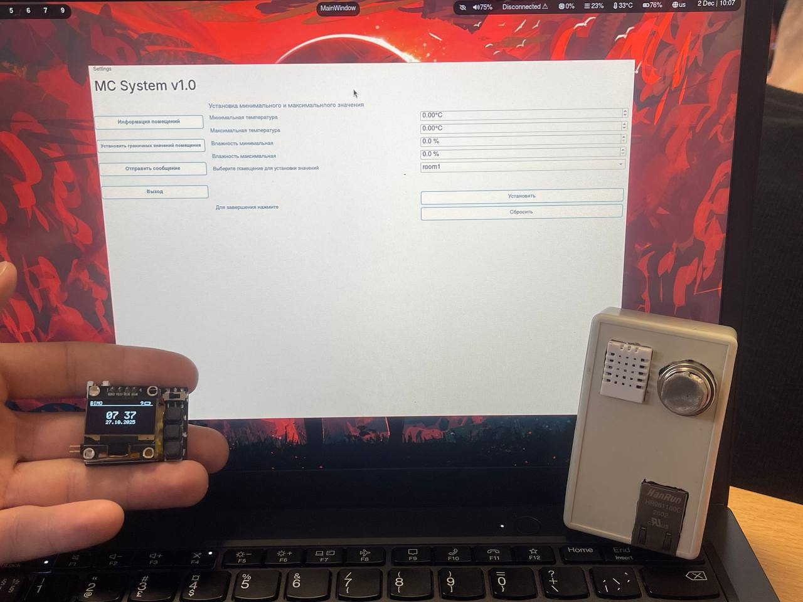
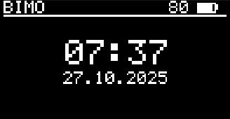
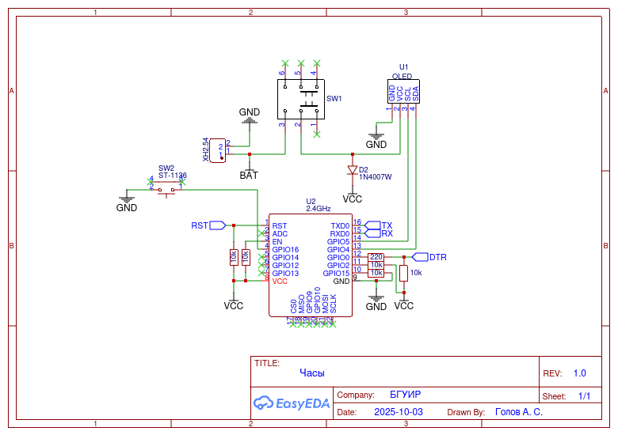
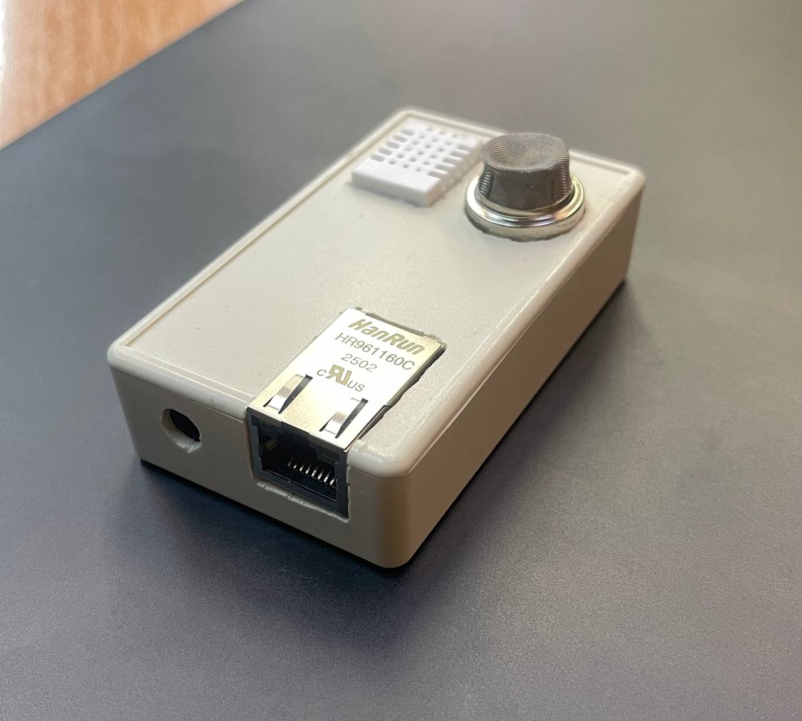
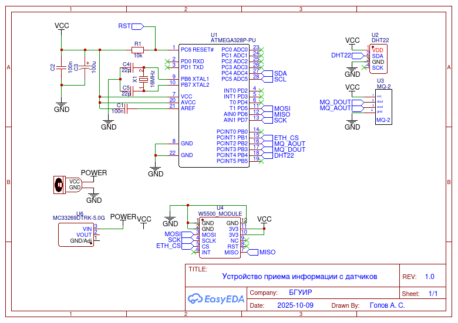
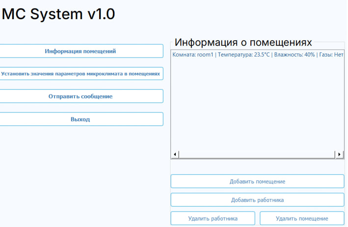

# mc-system

## Доступные языки
- [Английский](README.md)
- [Русский](README.ru.md)

## Описание
Разработана аппаратно-программная система для мониторинга микроклимата производственных помещений с функцией оповещения персонала посредством носимых электронных устройств сотрудников. Устройство отображает текущие параметры окружающей среды производственного помещения (температура, относительная влажность, давление, концентрация углеводородов), сравнивает их с заданными в программном обеспечении максимальными и минимальными значениями и в случае отклонений автоматически отправляет уведомления. Первоначальная конфигурация сети реализована через точку доступа, а дальнейшее взаимодействие осуществляется по протоколу MQTT.

## Принцип работы системы

**Развертывание системы выполняется в несколько последовательных этапов:**
1. **Развертывание сетевой и измерительной инфраструктуры в помещениях.** Системный администратор устанавливает в целевом объекте беспроводной маршрутизатор, интегрированный в локальную сеть предприятия. К этой сети подключается и настраивается через веб-интерфейс сенсорное устройство: указывается IP-адрес и порт MQTT-брокера, присваивается идентификатор помещения, задается интервал передачи телеметрии.

2. **Подготовка носимых электронных устройств персонала.** Сотрудникам выдаются персональные носимые электронные устройства (часы), которые предварительно настраиваются системным администратором. В их веб-интерфейсе определяются параметры подключения к беспроводной сети объекта (SSID и пароль), адрес и порт MQTT-брокера, а также идентификатор помещения, соответствующего рабочему месту сотрудника.

3. **Подключение и настройка рабочего места диспетчера.** Компьютер диспетчера, отвечающий за контроль работы системы, также интегрируется в сеть предприятия. На этой рабочей станции запускается при необходимости служба MQTT-брокера или устанавливается соединение с уже развернутым брокером, обеспечивая централизованный сбор данных со всех узлов системы.

4. **Ввод системы в эксплуатацию.** Система вводится в эксплуатацию после успешной настройки и интеграции всех компонентов.

## Передача сообщений по MQTT

После успешного установления соединения обмен данными между сенсорами, носимыми электронными устройствами и десктопным приложением осуществляется через MQTT-топики.

Сенсоры публикуют показания температуры, относительной влажности и давления в топики, сформированные на основе названия помещения:

**room_name/sensors/temperature**

**room_name/sensors/humidity**

**room_name/sensors/pressure**

Носимые электронные устройства получают персональные сообщения через топик, привязанный к их идентификатору:

**clock_id/messages**

Структура таких сообщений включает три обязательных поля:
- sender (имя отправителя)
- title (заголовок сообщения)
- message (текст сообщения)

Формат передачи использует символ ^ в качестве разделителя между полями, что обеспечивает корректный разбор строки на устройстве.

При первом запуске смарт-часы отправляют JSON-пакет со своей информацией (chipId, clockId, IP-адрес, статус соединения) в служебный топик connections.

Два специальных топика расширяют функциональность разработанной аппаратно-программной системы:
- **room_name/alarm** – используется для оповещения о критических отклонениях параметров микроклимата. При выходе значений за заданные границы на все часы, зарегистрированные в указанном помещении, отправляется сообщение ALARM. Получив такое сообщение, часы активируют акустические и вибросигналы для предупреждения пользователя об опасности.
- **datetime** – используется для публикации текущего времени, обновляемого в реальном времени. Это обеспечивает синхронизацию отображаемых данных и точность временных меток системы.

## Носимые электронные устройства (смарт-часы) для персонала

Для представления основной информации и обеспечения взаимодействия пользователя с устройством используется компактный OLED-дисплей.
Программная часть устройства реализована в виде многоконтурного интерфейса, где каждый контур отображает уникальную информацию. В правом верхнем углу экрана постоянно отображается индикатор уровня заряда аккумулятора.

**Основные контуры включают:**
- **Отображение системного времени и даты**
- **Информационный контур помещения** с отображением названия зоны и показаний датчиков (температура, относительная влажность, концентрация углеводородов)
- **Контур сообщений администрации** для доставки оперативных уведомлений

**Сетевая интеграция:**
Эти электронные устройства предназначены для интеграции в корпоративную сеть предприятия. При первом запуске устройство инициирует создание точки доступа с уникальным идентификатором. Информация об этой точке доступа, а также IP-адрес веб-интерфейса выводятся на встроенный экран. Этот интерфейс используется для первоначальной конфигурации и установки параметров соединения.

После выполнения первоначальной настройки устройство функционирует в пределах локальной сети предприятия и доступно по IP-адресу, заданному при инициализации. Для получения информации о текущем сетевом адресе предусмотрен специальный механизм: при двойном нажатии на кнопку действия соответствующий IP-адрес выводится на экран.

---

### Схема часов

Устройство часов построено на основе микроконтроллера ESP8266 со встроенным WiFi-модулем. Микроконтроллер поддерживается базовой обвязкой, состоящей из резисторов. Для работы устройства и навигации по меню предусмотрена кнопка управления, а также отдельный выключатель питания.

## Датчики для измерения параметров микроклимата

Наиболее критичными параметрами для мониторинга в производственных помещениях являются температура, относительная влажность и концентрация газов.

Для измерения температуры и относительной влажности использовался датчик **DHT22**. Это цифровой датчик с однопроводным интерфейсом, что упрощает подключение и снижает требования к аппаратному обеспечению. Он обеспечивает измерение температуры в диапазоне от –40 до +80 °C с точностью ±0,5 °C и измерение относительной влажности от 0 до 100 % с точностью ±2 %. Эти характеристики делают его пригодным для использования в цехах, складах и лабораториях. Встроенная калибровка и цифровой выходной сигнал повышают помехоустойчивость, а низкое энергопотребление позволяет применять датчик в автономных системах мониторинга. Интеграция с платформой Arduino достигается за счет готовых библиотек, обеспечивая простоту программирования и обмена данными.

Для контроля газового состава воздуха использовался полупроводниковый датчик **серии MQ‑5**, чувствительный к метану, природному газу и сжиженному углеводородному газу (СУГ). Его принцип работы основан на изменении сопротивления чувствительного слоя из диоксида олова (SnO₂) при взаимодействии с молекулами газа. В данном проекте использовался цифровой выход, позволяющий обнаруживать наличие газа в бинарном режиме.

### Схема датчиков

Сенсорное устройство построено на базе микроконтроллера ATMega328U, поддерживаемого базовой обвязкой, состоящей из конденсаторов и резисторов. В него интегрированы несколько модулей для мониторинга микроклимата и обнаружения газов в воздухе: датчик DHT22 для измерения температуры и влажности, а также датчик MQ-5 для обнаружения углеводородных соединений.

Взаимодействие с устройством, включая получение данных, настройку сети и регулировку интервала передачи сообщений, осуществляется через Ethernet, что позволяет идентифицировать сенсор и получить к нему доступ в сети.

## Десктопное приложение

Десктопное приложение выполняет функции **визуализации данных, настройки параметров и управления оповещениями**. Программный модуль предоставляет доступ к актуальной информации о состоянии микроклимата и предлагает инструменты для установки пороговых значений и отправки уведомлений на носимые электронные устройства сотрудников.

**Хранение данных:**
Для сохранения пользовательских настроек приложение использует файловую систему хранения:
- `rooms.txt` содержит соответствия IP-адресов помещений их названиям.
- `users.txt` содержит соответствия IP-адресов сотрудников их именам.

**Структура интерфейса:**
Интерфейс приложения организован в несколько основных функциональных разделов:

1. **Мониторинг микроклимата.**
   В главном окне отображаются текущие показания сенсоров, установленных в производственных помещениях. Каждая строка содержит информацию о названии помещения, температуре, относительной влажности и концентрации газа, предоставляя четкий обзор условий микроклимата в реальном времени.

2. **Добавление помещений и персонала.**
   Система поддерживает расширение путем добавления новых объектов. При добавлении помещения пользователь вводит его IP-адрес и название. Регистрация персонала выполняется аналогично, с указанием IP-адреса и имени, что позволяет привязать носимые устройства к конкретным пользователям.

3. **Настройка пороговых значений.**
   Пользователь может установить допустимые диапазоны для контролируемых параметров микроклимата, включая минимальные и максимальные значения для температуры и относительной влажности. Эти пороги используются для автоматического анализа поступающих данных и для генерации оповещений при выходе параметров за заданные границы.

4. **Оповещения сотрудников.**
   В приложении реализована функция отправки текстовых сообщений на носимые устройства (часы), привязанные к зарегистрированным IP-адресам персонала. Пользователь выбирает получателя из выпадающего списка и вводит текст сообщения, которое затем доставляется на соответствующее устройство. Это обеспечивает оперативное информирование персонала о критических изменениях в производственном микроклимате или других событиях.

**Дополнительные функции:**
- **Удаление помещения** удаляет помещение из списка и удаляет соответствующую запись в `rooms.txt`, исключая устаревшие зоны мониторинга.
- **Удаление сотрудника** удаляет запись в `users.txt` (IP-адрес и имя), и носимой устройство исключается из списка получателей сообщений.

**Технологии:**
Разработанное программное обеспечение адаптировано для кроссплатформенной работы с потенциальным расширением на другие операционные системы. В качестве языка программирования выбран Python благодаря обширным библиотекам для работы с сетью и обработки данных.

---

## Авторы
| Имя | Роль |
|----------|----------|
| [Александр Голов](https://github.com/lamerous) | Разработчик программного и аппаратного обеспечения |
| [Виолетта Солонович](https://github.com/viosolo) | Разработчик прикладного программного обеспечения |

## 📄 Лицензия
Этот проект лицензирован под лицензией [MIT](LICENSE).
